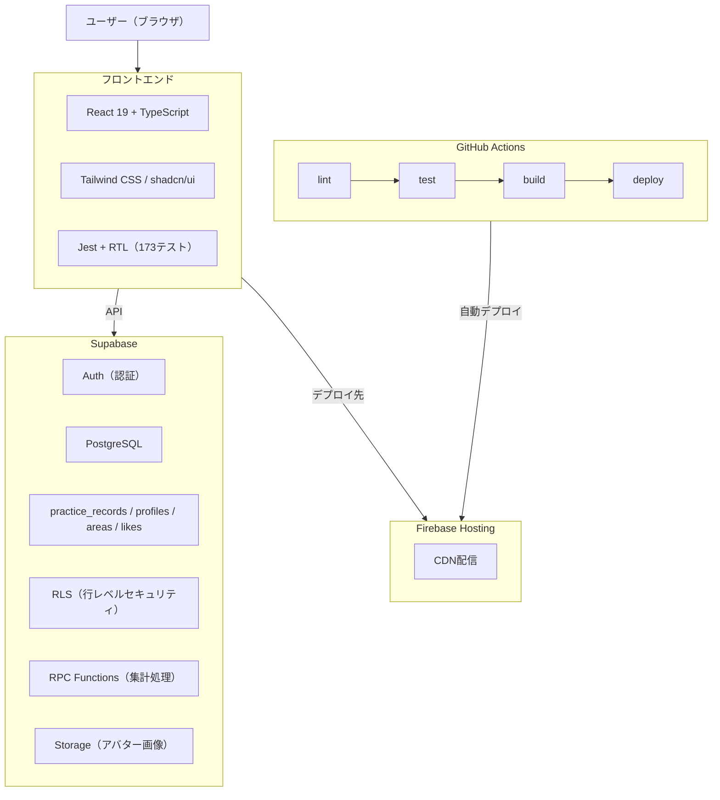

# スイモテ（Suimote）

> **泳げば泳ぐほどモテる** — 水泳練習記録 × マッチングアプリ

マッチングアプリ、疲れてませんか？

盛ったプロフィール、映えた写真、無限スワイプ。既存のマッチングアプリは自己申告ベースで、「本当にアクティブな人なのか」が見えません。一方で、練習記録アプリは記録するだけだと続かない。

**スイモテは「泳いだ距離」がそのままモテる理由になるアプリです。**

🔗 **アプリ**: [suimote-project.web.app](https://suimote-project.web.app)
📝 **技術記事**: [Qiita](https://qiita.com/jota9613/private/73b1a59a513a5eee98c8)

---

## デモ

### 練習記録のCRUD（追加 → 一覧 → 編集 → 削除）


### プロフィール編集 → マッチングON


### ユーザー一覧 → いいね → マッチ成立


### マッチ一覧 → 相手のプロフィール


---

## コンセプト

| ユーザー | 価値 |
|---|---|
| 男性 | 練習記録がそのまま「本気度の証明」。プロフィールを盛る必要がない |
| 女性 | まず記録アプリとして使える。マッチングはオプトインで後からONにできる |
| 両方 | 共通の趣味・活動実績ベースでつながる。「マッチングアプリ疲れ」への回答 |

---

## 設計判断 — なぜそうしたのか

ポートフォリオで一番大事なのは「何を作ったか」ではなく「**なぜそう作ったか**」だと思っています。

### 1. エリアベースのマッチング

> **問題**: 施設単位だとユーザーの母数が少なすぎてマッチしない
>
> **選択肢**: 施設単位 / 市区町村 / 独自エリア分割
>
> **決定**: 首都圏を12エリア（渋谷・新宿、池袋・板橋など）に分割。同じエリアのプールに通う人同士なら「実際に会いやすい」距離感を保てる

### 2. マッチング機能はオプトイン

> **問題**: マッチングアプリへの抵抗感（特に女性ユーザー）
>
> **選択肢**: 全員マッチングON / オプトイン / 招待制
>
> **決定**: デフォルトOFF。「記録アプリだと思って入れたら、出会いの機能もあった」という自然な導線。記録アプリとしてだけ使い続けることも可能

### 3. 相互いいねでマッチ成立

> **問題**: 一方的ないいねによるスパム・不快感
>
> **決定**: 双方向の意思確認が必要。安全性と真摯な出会いを担保

### 4. RLSをDB層で実装

> **問題**: API層だけのセキュリティは漏れのリスクがある
>
> **決定**: Supabaseの行レベルセキュリティ（RLS）で「自分のデータは自分だけ」をDB層で保証。フロントエンドのバグがあってもデータ漏洩しない

---

## アーキテクチャ



---

## 技術スタック

| カテゴリ | 技術 |
|---|---|
| フロントエンド | React 19 / TypeScript / Vite / Tailwind CSS / shadcn/ui |
| バックエンド・DB | Supabase（PostgreSQL / Auth / Storage / RPC） |
| ホスティング | Firebase Hosting（CDN配信） |
| CI/CD | GitHub Actions（lint → test → build → deploy） |
| テスト | Jest / React Testing Library（**173テスト / 4秒で全パス**） |

---

## 品質へのこだわり

### 173テスト、4秒で全パス

手動だと30分以上かかる確認が `npm test` で4秒。コードを変更するたびに「壊れてないか」を一瞬で検証できる。

| テスト対象 | 件数 |
|---|---|
| UIコンポーネント | 14 |
| カスタムHooks | 10 |
| ユーティリティ | 3 |

### CI/CDで安全網

`git push` するだけで lint → test → build → deploy が自動実行。テストが落ちたらデプロイされない。

### 開発中に発見したバグ

| 発見内容 | 詳細 | 教訓 |
|---|---|---|
| **RLS無効** | `practice_records`テーブルのRLSがDISABLED。ポリシーはあったがスイッチがOFFだった | DB側のセキュリティ確認は必ずやる |
| **存在しないRPC関数** | `get_monthly_practice_count`がDBに未実装。Dashboard手動作成のためmigrationに残っていなかった | migration = DB変更履歴。必ずセットで管理 |

---

## 開発プロセス — 1ヶ月 × 7フェーズ

どのフェーズで時間切れになっても**動くプロダクトが残る設計**。

| フェーズ | 内容 | 状態 |
|---|---|---|
| MVP1-3 | 練習記録アプリとして先行リリース | ✅ 完了 |
| MVP4-5 | マッチング機能をオプトインで追加 | ✅ 完了 |
| MVP6 | 全体動作確認・デザイン調整 | ✅ 完了 |
| MVP7 | 技術記事・README整備 | ✅ 完了 |

---

## セットアップ

```bash
# クローン
git clone https://github.com/Jota96131/Suimote-project.git
cd Suimote-project

# 依存関係インストール
npm install

# 環境変数を設定
cp .env.example .env
# .env に Supabase の URL と anon key を記入

# 開発サーバー起動
npm run dev

# テスト実行
npm test

# ビルド
npm run build
```

---

## 今後の展望（v2）

| 機能 | 技術 |
|---|---|
| 位置情報で近くの人を表示 | Geolocation API |
| ナイトプールイベント連携 | 会場ベースマッチング |
| DM（チャット）機能 | Supabase Realtime |
| 練習実績バッジ拡充 | 距離・連続記録でランクアップ |
| 収益化 | イベントチケット販売・プレミアムプラン |

---

## ライセンス

ISC
