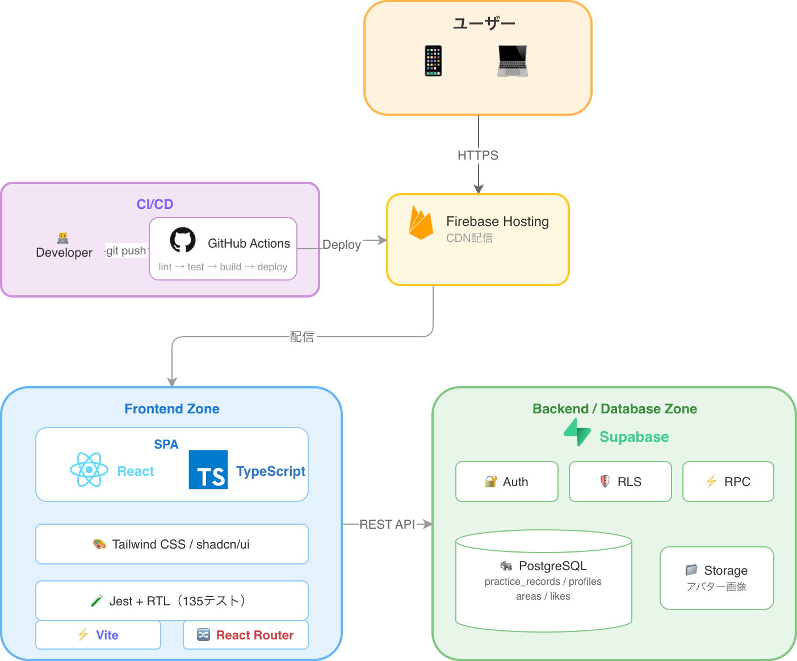

# スイモテ（Suimote）🏊

> **泳げば泳ぐほどモテる** — 水泳練習記録 × マッチングアプリ

  
  
  
  
  
  

**泳いだ距離がそのままモテる理由になる。** プロフィールを盛る必要なし。練習記録が「本気度の証明」になるマッチングアプリです。

🔗 [アプリを見る](https://suimote-project.web.app) ｜ 📝 [技術記事（設計判断・学びの詳細）](https://qiita.com/jota9613/private/73b1a59a513a5eee98c8)

---

## デモ

<table>
  <tr>
    <td align="center"><b>練習記録 CRUD</b></td>
    <td align="center"><b>プロフィール編集 → マッチングON</b></td>
  </tr>
  <tr>
    <td></td>
    <td></td>
  </tr>
  <tr>
    <td align="center"><b>いいね → マッチ成立</b></td>
    <td align="center"><b>マッチ一覧 → プロフィール</b></td>
  </tr>
  <tr>
    <td></td>
    <td></td>
  </tr>
</table>

---

## 技術スタック

| カテゴリ | 技術 |
|---|---|
| フロントエンド | React 19 / TypeScript / Vite / Tailwind CSS / shadcn/ui |
| バックエンド・DB | Supabase（PostgreSQL / Auth / Storage / RPC / RLS） |
| ホスティング | Firebase Hosting |
| CI/CD | GitHub Actions（lint → test → build → deploy） |
| テスト | Jest / React Testing Library — **173テスト / 4秒で全パス** |

---

## アーキテクチャ

---

## 設計判断のハイライト

> 詳細は [Qiita技術記事](https://qiita.com/jota9613/private/73b1a59a513a5eee98c8) に書いています

- **エリアベースのマッチング** — 施設単位だと母数が少なすぎる → 首都圏12エリアに分割
- **マッチング機能はオプトイン** — デフォルトOFF。記録アプリとしてまず価値提供し、自然な導線でマッチングへ
- **RLSをDB層で実装** — API層だけでなくDB層で「自分のデータは自分だけ」を保証
- **MVP7段階のリリース戦略** — どのフェーズで止まっても動くプロダクトが残る設計

