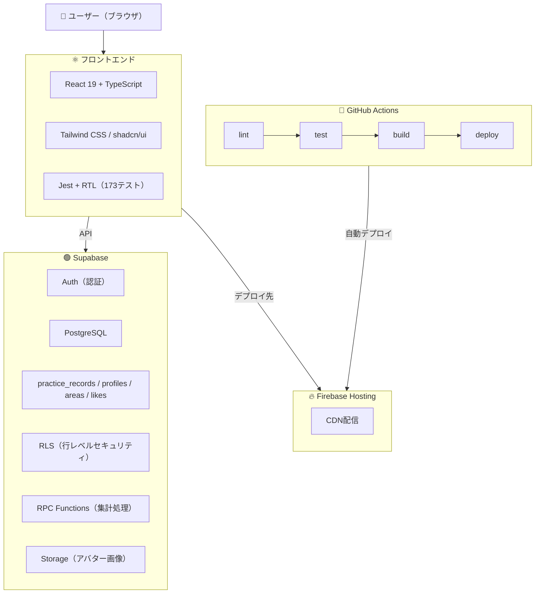

# 【個人開発】泳げば泳ぐほどモテる。水泳×マッチングアプリ「スイモテ」を作りました【React × Supabase × Firebase】

## はじめに

「マッチングアプリ疲れ」という言葉を最近よく聞きます。

プロフィールを盛って、いいねを送って、メッセージを続けて——それでも会えるかわからない。既存のマッチングアプリは自己申告ベースなので、「本当にアクティブな人なのか」が見えません。

一方で、水泳の練習記録アプリは世の中にいくつかあります。ただ、記録するだけだと続かない。モチベーションが保てない。

**「記録アプリだけだと続かない。マッチングアプリだけだと疲れる。じゃあ融合させたら？」**

そう考えて作ったのが **スイモテ（Suimote）** です。

---

## コンセプト

> **泳げば泳ぐほどモテる**

スイモテ = 「すいすいモテる」。名前にコンセプトが全部詰まっています。

- 練習記録 = マッチングのプロフィール
- 泳いだ距離・回数が「本気度の証明」になる
- プロフィールを盛る必要がない
- 出会いの場がプール・ナイトプール

### ユーザー価値

| ユーザー | 価値 |
|---|---|
| 男性 | 練習記録がそのまま「本気度の証明」。プロフィールを盛る必要がない |
| 女性 | まず記録アプリとして使える。マッチングはオプトインで後からONにできる |
| 両方 | 共通の趣味・活動実績ベースでつながる。「マッチングアプリ疲れ」の回答 |

---

## アーキテクチャ

---

## デモ

<!-- TODO: デモGIFを挿入 -->

### 1. 練習記録のCRUD（追加 → 一覧 → 編集 → 削除）
<!-- GIF -->

### 2. プロフィール編集 → マッチングON
<!-- GIF -->

### 3. ユーザー一覧 → いいね → マッチ成立
<!-- GIF -->

### 4. マッチ一覧 → 相手のプロフィール
<!-- GIF -->

---

## 技術選定

### なぜReact（TypeScript）？

- コンポーネント指向でUI部品を再利用しやすい
- TypeScriptで型安全。DBのテーブル定義と型を一致させることでバグを防げる
- エコシステムが豊富（React Router, Jest, shadcn/ui）

### なぜSupabase？

- PostgreSQLベースで、RLS（行レベルセキュリティ）が使える → 「自分のデータは自分だけ」をDB層で保証
- RPC関数でサーバー側計算 → 累計距離・月間回数をDB側で集計して返す
- リアルタイム機能やStorageも標準装備 → v2のDM機能に拡張可能

### なぜFirebase Hosting？

- 無料枠が十分
- GitHub Actionsとの連携が簡単
- CDNで配信されるので表示が速い

### なぜGitHub Actions？

- pushするだけで lint → test → build → deploy が自動実行
- テストが落ちたらデプロイされない = 安全網

---

## 設計判断

### 1. エリアベースのマッチング

施設単位ではなく、首都圏を12エリア（渋谷・新宿、池袋・板橋など）に分割。

- **施設単位だと母数が少なすぎる**問題を解決
- 同じエリアのプールに通う人同士なら「会いやすい」

### 2. オプトイン方式

マッチング機能はデフォルトOFF。ユーザーが自分でONにして初めて有効化。

- 女性ユーザーの心理的ハードルを下げる
- 「記録アプリだと思って入れたら、出会いの機能もあった」という自然な導線
- 記録アプリとしてだけ使い続けることも可能

### 3. 相互いいねでマッチ成立

一方的ないいねではマッチしない。お互いがいいねを送って初めてマッチ成立。

### 4. 段階的リリース（MVP戦略）

1ヶ月を7つのMVPに分割し、各フェーズで「テスト → CI/CD → 自動デプロイ」を完結。

| フェーズ | 内容 | 状態 |
|---|---|---|
| MVP1-3 | 練習記録アプリとして先行リリース | 完了 |
| MVP4-5 | マッチング機能をオプトインで後出し追加 | 完了 |
| MVP6 | 全体動作確認・デザイン調整 | 完了 |
| MVP7 | 技術記事・README整備 | ← 今ここ |

**どのフェーズで時間切れになっても動くプロダクトが残る設計。**

---

## 学び・気づき

### テストは最強の味方

全機能に対して173のテストを書いた。MVP6の全体動作確認で `npm test` を実行したら、**4秒で173項目がすべてPASS**。

手動だと30分以上かかる確認が、コマンド1つで完了。コードを変更するたびに「壊れてないか」を一瞬で検証できるのは、テストを書いてきたからこそ。

### RLSの不備を通し確認で発見

MVP6の通し確認で、`practice_records` テーブルのRLSが**無効（DISABLED）**だったことを発見。ポリシーは作ってあったのにスイッチがOFFだった。

手動テストだけでは気づけなかったかもしれない。**DB側のセキュリティ確認は必ずやるべき**と実感。

### 存在しないRPC関数の発見

`get_monthly_practice_count` 関数がDBに存在しないことも通し確認で判明。migrationファイルに書いていなかったため、Dashboardで手動作成したものが記録に残っていなかった。

**migrationファイル = DBの変更履歴。必ずセットで残す**ことの重要性を学んだ。

---

## 今後の展望（v2以降）

- **位置情報** — 近くのプールにいる人をリアルタイムで表示
- **ナイトプールイベント連携** — 会場にいる人同士でマッチング
- **DM（チャット）機能** — Supabase Realtimeを利用
- **練習実績バッジの拡充** — 累計距離・連続記録でランクアップ
- **収益化** — イベントチケット販売・プレミアムプラン

---

## 技術スタック

| カテゴリ | 技術 |
|---|---|
| フロントエンド | React 19, TypeScript, Vite, Tailwind CSS, shadcn/ui |
| バックエンド/DB | Supabase (PostgreSQL, Auth, Storage, RPC) |
| ホスティング | Firebase Hosting |
| CI/CD | GitHub Actions (lint → test → build → deploy) |
| テスト | Jest, React Testing Library |
| アイコン | Lucide React |
| フォント | Geist |

---

## おわりに

「記録するだけ」のアプリは続かない。「出会うだけ」のアプリは疲れる。

スイモテは **「泳いで、つながる」** という新しい体験を提供するアプリです。

フィットネス記録とマッチングの融合は未開拓の領域。この記事が、同じように個人開発に挑戦する方の参考になれば幸いです！

GitHub: <!-- TODO: リポジトリURL -->
アプリ: https://suimote-project.web.app
